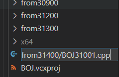
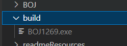

# ProblemSolvingCpp

`C++` 로 진행하는 문제풀이

## VSCode

`2024-07-17` 부로 `Visual Studio` 에서 `Visual Stdudio Code` 로 IDE를 옮김.

### 코드 실행 방법

파일 작성 위치 : `BOJ/BOJ/fromXXXX/BOJXXXX.cpp` 식으로 작성

빌드 파일 위치 : `./build/BOJXXXX.exe` 파일로 생성됨.

`F5` : 빌드 및 디버깅

`Shift + F5` : 빌드 후 실행